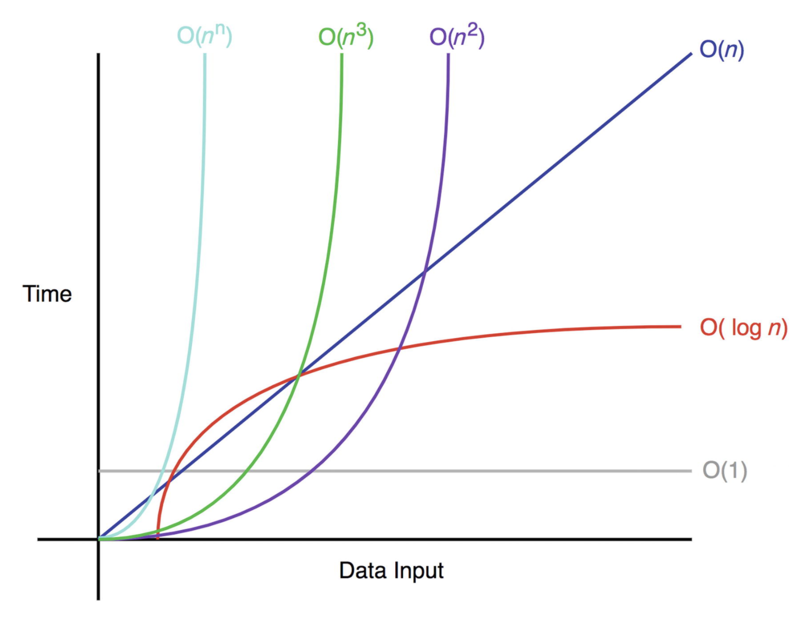

<br/>
<br/>

# 💡 빅오(Big-O) 란 ?
 알고리즘의 성능을 수학적으로 표현하는 방법이다. 알고리즘의 시간/공간 복잡도를 표현한다. 단, 단순히 코드의 러닝타임만을 계산하는게 아니라, ** 장기적으로 데이터가 늘어남에 따라 처리시간이 얼마나 증가하는지에대한 예측 ** 을 하는 것이다. 

 때문에 빅오에서 가장 중요한 개념은 __상수는 과감하게 버리는 것__ 이다. 

상수는 고정된 숫자이기 때문에 증가율에 영향을 미칠 때 언제나 고정된 상수만큼씩만 영향을 미치기 때문이다. 여기서 증가하지 않는 숫자는 신경을 쓰지 않는다. 


> * 시간복잡도 : 알고리즘의 처리 속도 
> 
> * 공간복잡도 : 메모리 사용량 

<br/>
<br/>

# 💡 빅오 표기법에 따른 성능 


> O( 1) < O( log n) < O( n) < O( n* log n ) < O( n²) < O( n³)  < O( 2n )  
 
<br/>



<br/>
<br/>

# 💡 빅오 표기법에 따른 시간복잡도 분석 

## 👉 O(1) 상수형 빅오

입력한 데이터의 크기와 상관없이 언제나 일정한 시간복잡도를 가진다. 즉 데이터 수에 상관없이 연산횟수가 고정인 유형의 알고리즘 

```
F(int[] m){
    return (n[0] == 0) ? true:false;
}
```


<br/>

## 👉 O(n) 선형 빅오 

입력한 데이터의 크기에 비례해서 처리시간이 증가하는 알고리즘 

```
F(int[] n){
    for i = 0 to n.length
    print i
}
```

<br/>

## 👉 O(n²) 

입력받은 n의 갯수만큼 2번을 이중루프를 돈다.
데이터가 많아질수록 처리시간으 급수적으로 늘어나는 알고리즘. 대표적으로 이중루프가 있다. 

```
F(int[] n){
    for i = 0 to n.length
        for j = 0 to n.length
            print i + j;
}
```

<br/>

## 👉 O(nm) 

코드만 보면 O(n2) 과 비슷하여 혼동하기 쉽지만,m을 n 만큼 루프를 돌리는 것이다. 
O(n²)에서 m 이 n 보다 작으면 적은 시간이 걸리지만, m 이 n보다 같거나 크면 시간복잡도가 증가한다. 

```c
F(int[] n, int[] m){
    for i = 0 to n.length
        for j = 0 to m.length
            print i + j;
}
```

<br/>

## 👉 O(n3) 

O(n2) 와 비슷한 그래프를 띄지만 데이터가 증가함에 따라 더욱 급격하게 처리시간이 늘어난다. 즉 입력 데이터 크기의 세제곱에 비례한 시간복잡도를 갖는다. 

<br/>

## 👉 O(2ⁿ)

데이터량이 많아질수록 처리시간이 기하급수적으로 늘어나는 알고리즘. 피보나치 수열이 대표적. 지수형 빅오 라고도 한다.  재귀합수로 트리 구조를 스캔해야 하기 때문에 연산횟수의 증가에 따른 처리시간이 굉장히 증가한다. 

```c
F(n, r){
    if(n<=0) return 0;
    else if (n==1) return r[n] =1;
    return r[n] = F[n-1,r] + F(n-2,r);
}
```

<br/>


## 👉 O(log₂ n) 

입력 테이터의 크기가 커질수록 처리시간이 로그만큼 짧아지는 알고리즘. 시간복잡도가 낮다.  입력크기에 따라 처리시간이 증가하는 정렬알고리즘에서 많이 사용됨. 이진탐색이 대표적인 알고리즘. 

```c
F(k, arr, s, e){
    if(s > e) return -1;
    m = (s+e) / 2;
    if(arr[m]== k) return m;
    else if (arr[m]>k) return F(k,arr,s,e);
    else return F(k,arr,m+1,e);
}
```

<br/>

## 👉 O(sqrt(n))  

테이터 양의 제곱근으로만 풀리는 알고리즘. 

<br/>
<br/>
<br/>

---

<center>references</center> 
  
<br/>

- [<자료구조 알고리즘> 빅오(Big-O)표기법 완전정복](https://www.youtube.com/watch?v=6Iq5iMCVsXA&list=PLjSkJdbr_gFYSUYfnF_OGXtnGs2d3vWg7)
- https://velog.io/@raram2/big-o-notation-and-time-complexity
