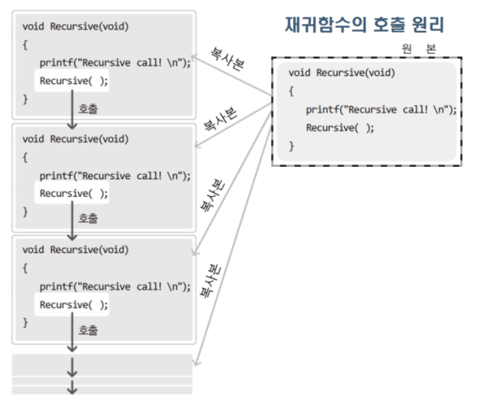
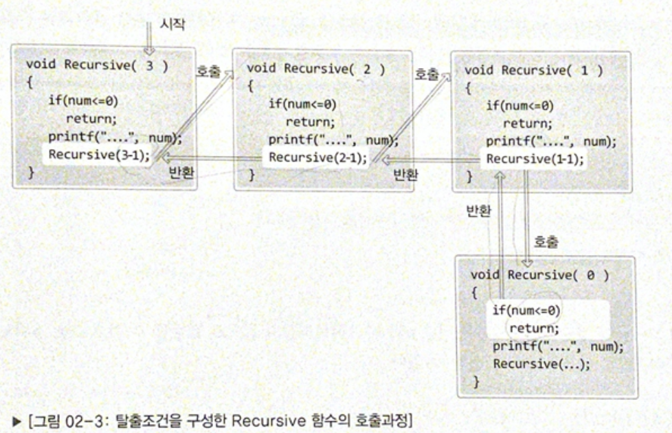

<br/>
<br/>
<br/>


## 🥑 재귀함수란 
: 간단히 말해서 자기 자신을 호출하는 함수이다. 모든 재귀함수는 기본단계 (base case) 와 재귀단계(recursive case) 로 나누어져 있다. 

- 기본단계(base case) : 함수가 자기 자신을 호출하지 않는 경우, 즉 무한 반복으로 빠져들지 않게 하는 부분
- 재귀단계(recursive case): 함수가 자기 자신을 호출하는 부분 

<br/>

재귀함수가 호출될 때 자기 자신을 재 호출하는 것이 아니라, 함수가 호출되면 원본 함수의 복사본이 만들어져서 실행되는 구조이다. 


출처:https://zelord.tistory.com/13

<br/>
<br/>

위의 그림은 재귀함수의 탈출 조건이 정의되어있지 않아서 무한 반복에 빠지게 된다. 
기본단계(base case)가 추가된 재귀함수의 사이클은 다음과 같은 형태로 실행된다. 


출처: 윤성우의 열혈 자료구조 도서 참조


<br/>
<br/>
<br/>

 ## 🥑 호출스택 
push 와 pop 으로 메모리를 관리하는 간단한 자료구조이며,  
여러개의 함수를 호출하면서 함수에 사용되는 변수를 저장하는 스택을 call stack(호출스택) 이라고 한다. 

콜스택에는 크게 매개변수에 대한 정보, 반환 주소에 대한 정보, 지역변수에 대한 정보가 담긴다.

<br/>
<br/>
<br/>

## 🥑 재귀함수에서 호출스택 사용 
재귀함수에서도 호출스택을 사용한다. 대표적인 예시로 팩토리얼 함수를 살펴보자. 


***팩토리얼이란?*** : 1 ~ 자기 자신의 수까지 곱한 결과값   

```java
public static int factorial(int n) {
	if (n == 1) {
		return 1;
	}
	return n * factorial(n-1);
}
```

<br/>


이러한 재귀함수는 위에서 설명했듯이 복사본을 만들어 스택에 쌓기 때문에 메모리를 많이 차지한다는 단점이 있다.  
함수 호출을 할 때마다 메모리를 사용하게 되고, 스택 메모리게 커지게 되면 스택 오버플로우가 발생할 수 있다.

***스택오버플로우란?*** : 스택이 할당된 공간보다 많은 공간을 차지할때 발생하는 프로그래밍 오류


<br/>
<br/>
<br/>

위와 같은 스택 메모리의 부담을 덜기 위해 꼬리 재귀(tail recursion) 라는 방법을 사용할 수 있다. 

<br/>

> ### 꼬리재귀
꼬리재귀를 사용하기 위한 조건으로는 컴파일러가 꼬리재귀에 대한 최적화를 지원해야한다느 것이다. 모든 프로그래밍 언어에서 지원하는 것은 아니라는 것을 알아두자. 

꼬리재귀를 사용한 팩토리얼 코드 
```java
public static int factorial(int n, int acc) {
	if (n == 1) {
		return acc;
	}
	return n * factorial(n-1, acc*n);
}
```

<br/>
<br/>
<br/>

---
references

<br/>

- 그림으로 개념을 이해하는 알고리즘 by아디트야 바르가바 (한빛미디어 출판)
- https://lygggg.github.io/blog/recursive/
- https://developer.mozilla.org/ko/docs/Glossary/Call_stack
- 윤성우의 열혈자료구조 - 오렌지미지어 출판

