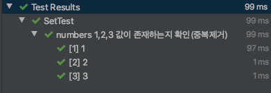
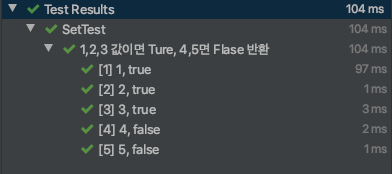

<br/>
<br/>
<br/>

## @ParameterizedTest

JUnit5에서 추가된 새로운 기능 중 하나이다. 

매개변수를 사용해서 단일테시트를 여러번 실행할 수 있다. 

먼저 @ParameterizedTest 를 사용하기 위해서는 `pom.xml` / `build.gradle` 에 `Junit-jupiter-params`의존성을 추가해주어야 한다. 

<br/>

Maven 의존성 추가

```java
<dependency>
    <groupId>org.junit.jupiter</groupId>
    <artifactId>junit-jupiter-params</artifactId>
    <version>5.7.0</version>
    <scope>test</scope>
</dependency>
```

Gradle 의존성 추가

```java
testCompile("org.junit.jupiter:junit-jupiter-params:5.7.0")
```

<br/>
<br/>

## Example

```java
public Class Example{
 private set<Integer> numbers;

	@BeforeEach
   void setUp() {
        numbers = new HashSet<>();
        numbers.add(1);
        numbers.add(1);
        numbers.add(2);
        numbers.add(3);
    }
}
```
<br/>


### @ValueSource를 활용한 단순 값 비교

numbers 변수 안에 1,2,3 값이 들어있는지 확인하는 단위테스트를 작성해보자 

```java
	 @Test
	 @DisplayName("numbers 1,2,3 값이 존재하는지 확인")
	 void contains() {
         assertThat(numbers.contains(1)).isTrue();
         assertThat(numbers.contains(2)).isTrue();
         assertThat(numbers.contains(3)).isTrue();
	 }
```

위와 같이 작성했을 시에 asserThat 문이 중복되어 코드가 길어진다. 

<br/>

이를 @ParameterizedTest를 활용해서 중복 코드를 줄여보자 

```java
	@ParameterizedTest
    @ValueSource(ints = {1,2,3})
    @DisplayName("numbers 1,2,3 값이 존재하는지 확인(중복제거)")
    void is_SouldContainsNumberOneTwoThree(int num){
        assertThat(numbers.contains(num)).isTrue();
    }
```

@ValueSource를 사용하여 리터럴 값의 배열을 테스트 메서드로 전달할 수 있다. 



위의 테스트케이스에서는 1,2,3 값이 아닌 다른 값이 들어가면 테스트 오류가 난다. 

Ture, False 값으로 반환하는 테스트케이스를 작성해보자. 

<br/>
<br/>

### @CsvSource를 활용하여 Ture, False 값 반환하기
<br/>

```java
	@DisplayName("요구사항3) 1,2,3 값이면 Ture, 4,5면 Flase 반환")
    @ParameterizedTest
    @CsvSource(value = {"1,true","2,true","3,true","4,false","5,false"})
    void contains_TrueOrFalse(int num, boolean expected) {
        assertThat(numbers.contains(num)).isEqualTo(expected);
    }
```

"1,true" 에서 1은 `int num`, true는 `boolean expected` 의 타입으로써 매개변수로 전달된다. 

@CsvSource 는 기본적으로 콤마',' 가 구분자이며, delimiter 속성을 추가해주면 구분자를 지정해줄 수 있다. 

```java
@CsvSource(value = {"1:true","2:true","3:true","4:false","5:false"}, delimiter = ':')
```




<br/>

그 외에 @NullSource, @EmptySource, @EnumSource, @CsvFileSource, @MethodSource 등과의 어노테이션을 활용할 수 있다. 

<br/>
<br/>

출처 및 자세히 보기 → [https://www.baeldung.com/parameterized-tests-junit-5](https://www.baeldung.com/parameterized-tests-junit-5)