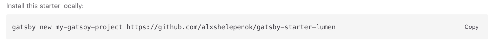

***먼저 nvm - node - npm 설치가 되어있어야 한다.*** 

👉 [설치 참고한 링크](https://gist.github.com/falsy/8aa42ae311a9adb50e2ca7d8702c9af1)

<br/>

## 💡 gatsby cli 설치 
```cli
$ npm install -g gatsby-cli
```

<br/>
<br/>


## 💡 gatsby 블로그 테마 고르기 
[gatsby starter theme <-블로그 테마 선택](https://www.gatsbyjs.com/starters/?)

<br/>
<br/>


## 💡 로컬에 블로그 설치하기 
 마음에 드는 블로그 테마를 선택하면 다음과 같이 copy할 코드가 적혀있다.
 
이를 그대로 터미널에서 실행하면 해당 위치에 'gatsby-blog-mdx' 라는 이름으로 블로그 디렉토리가 생성된다.




 ```bash
 # Using npx
$ gatsby new gatsby-blog-mdx https://github.com/EllisMin/gatsby-blog-mdx
 ```

<br/>

설치 왼료 후에 아래의 명령어로 gatsby 를 실행시킨다.

```bash
$ cd gatsby-starter-minimal-blog
$ gatsby develop
```

<br/>

설치 완료 후 로컬 주소에서 블로그가 뜨는 것까지 확인한다.
- http://localhost:8000/  

<br/>
<br/>

## 💡 Git pages로 배포 

git pages를 설치해준다.
```bash
$ npm install gh-pages --save-dev
```

<br/>

로컬 블로그 디랙토리 내에 위치해있는 package.json 파일 안에 다음과 같이 추가해준다. deploy는 나중에 원격저장소에 배포할때 사용하는 명령어이다. 
```
script {
    (...) ,
"deploy": "gatsby build && gh-pages -d public -b master",
    (...)
}
```
<br/>
<br/>

## 💡 로컬 저장소와 원격 저장소(GitHub) 연결하기 

{username}.githyb.io 이름의 레파지토리를 생성해준 다음, 
아래의 코드로 로컬에 있는 파일을 원격 저장소와 연결해준다.
```bash
$ git remote add origin https://github.com/username/username.github.io.git
$ git add .
$ git checkout -b develop
$ git commit -m "first commit"
$ npm run deploy
```

{username}.githyb.io 주소로 들어가보면 블로그가 깃페이지로 배포된 것을 확인할 수 있다. 

<br/>
<br/>

## 💡 파일 배포 순서 

```bash
$ git checkout develop
$ git add .
$ git commit -m “commit message”
$ git push origin develop 
$ npm run deploy        # 원격 저장소의 메인 브런치에 배포 
```

<br/>
<br/>
<br/>

처음에 develop 브랜치에서 커밋 후 푸시하지 않고 바로 main 으로 배포했더니 파일 변경사항이 반영이 안되어서 해결하느라 애먹었다. 그 뒤에 병합을 또 잘못해서 파일들이 충돌나고...결국 블로그를 새로 만들게 되었다..

앞으론 실수없이 무사히 블로그를 운영할 수 있기를 바란다..🙏