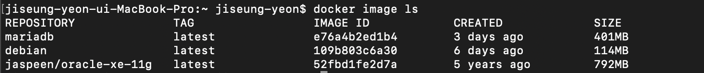
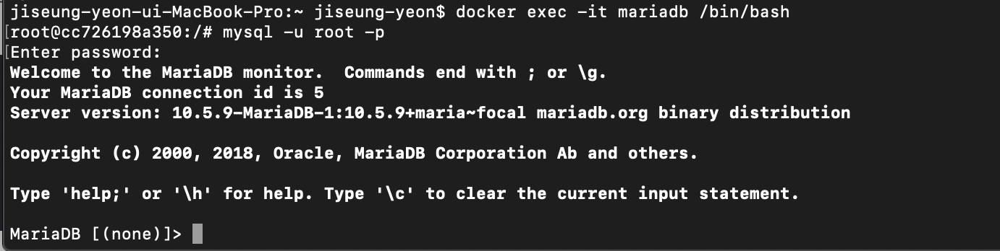

<br/>
<br/>

# 🐳 mariaDb 이미지 다운

도커에서 마리아디비 컨테이너를 실행할 수 있는 이미지를 다운 

```cli
docker pull mariadb 
```

<br/>

image 리스트에서 확인 

```cli
docker image ls
```



<br/>
<br/>
<br/>

# 🐳 mariaDB 실행하기 

다운받은 이미지를 기반으로 도커 컨테이너를 실행시킨다 
```cli
docker run --name mariadb -d -p 3306:3306 -e MYSQL_ROOT_PASSWORD=mariadb mariadb
```

> --name : 컨테이너 이름
>
> -d : 데몬 실행
> 
> -p : 로컬 port와 컨테이너 포트 연결
> 
> -e : 환경 변수 설정

<br/>
<br/>


실행중인 도커 확인 
```cli
docker ps
```
<br/>


mariaDB 컨테이너의 커맨드 창에 접혹하기 

```cli
docker exec -it mariadb /bin/bash
```
<br/>
<br/>
<br/>

# 🐳 mariaDB 접속하기 

위의 mariaDB 커맨드 창에 접속한 상태에서 아래의 명령어를 입력해준다. 

```cli
mysql -u root -p
```




종료는 exit 입력

<br/>

## ✍ 한글 인코딩 설정 

해당 컨테이너 안에 편집기를 설치하고 난 뒤 설정을 바꿔줄 수 있다. 
```cli
apt-get update && apt-get install nano vim
```
<br/>

설청 추가하기 
```cli
[client]
default-character-set = utf8mb4

[mysql]
default-character-set = utf8mb4

[mysqld]
character-set-client-handshake = FALSE
character-set-server = utf8mb4
collation-server = utf8mb4_unicode_ci
```
<br/>
<br/>
<br/>

---

___reference___

<br/>

* https://firework-ham.tistory.com/105