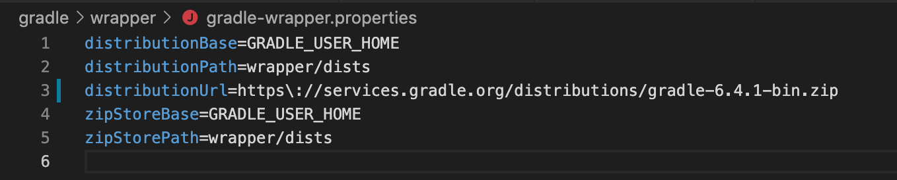
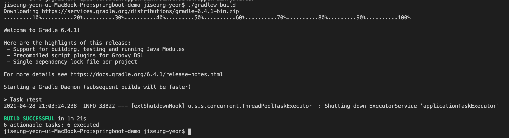

<br/>
<br/>
<br/>


## ❓ERROR 
터미널에서 ``` ./gradlew bootrun ``` 명령어로 스프링부트 실행 시 

```
Task 'bootRun' not found in root project
``` 
다음과 같은 에러가 발생.

<br/>
<br/>
<br/>

## 💡해결방안 

```
gradlew clean
```

```
gradlew build
```
 순서대로 해주면 된다. 

 <br/>
<br/>


하지만 ``` gradlew build ``` 명령어 실행 시  아래와 같은 에러가 출력되었음. 


대충 그래들 버전 5 이상으로 높여야 된다는 거 같아서 그래들 버전을 높여주었다. 

 <br/>
<br/>

***[gradle-wrapper.properties]***



그래들 버전이 기존엔 4.*대 였던 것을 6점대로 올려주었다. 

 <br/>
<br/>

***빌드 성공!***
