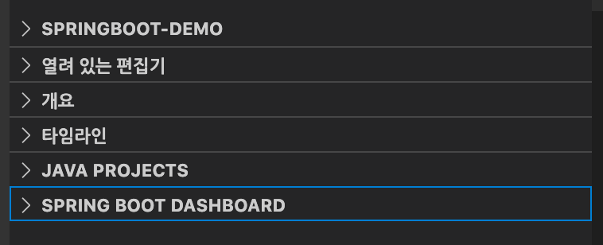
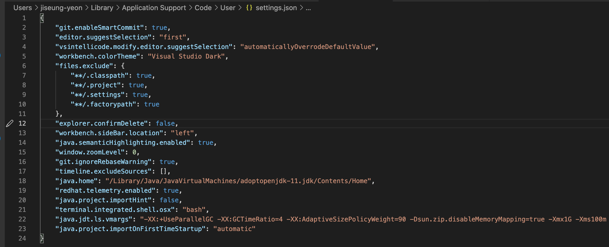

<br/>
<br/>
<br/>


## ❓ERROR 
스프링부트 어플리케이션을 실행할 대 사용하는 spring boot dashboard 가 활성화가 안되는 현상. 



저 안에 아무것도 안나타남 

<br/>
<br/>
<br/>

## 💡해결방안 

스프링부트 대시보드가 활성화되지 않는 이유는 다양한 것 같다. 이번 같은 경우는 롬복 설치가 안되는것을 해결한답시고 ```setting.json``` 파일을 잘못 건드려 버려서 활성화가 안되는 현상이 나타났다. 

<br/>



<br/>

```"java.jdt.ls.vmargs"``` 설정에서 

```
-XX:+UseParallelGC -XX:GCTimeRatio=4 -XX:AdaptiveSizePolicyWeight=90 -Dsun.zip.disableMemoryMapping=true -Xmx1G -Xms100m
```
위의 내용이 빠져있었다. 다시 저 내용으로 원복하고 나니 스프링부트 대시보드 활성화가 잘 된다. 

<br/>
<br/>
<br/>
<br/>
<br/>
<br/>


***vscode로 스프링부트 하려니 좀 귀찮은게 아니다...***

***스프링부트는 무조건 인텔리제이인 것인가...***