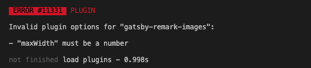

<br/>
<br/>
<br/>


## ❓ERROR 

```gatsby develop``` 했을 시에 ```gatsby-remark-images``` 플러그인 옵션 에러가 발생한다. 



'maxWith' 값이 number 값으로 안넘어가고 string 값으로 넘어가고 있기 때문에 발생한 오류이다. 

하지만 이전까지 스트링값으로 넘겨줘도 오류없이 잘 작동되었다. 일전에 강제로 ```npm audit fix --force``` 를 한 탓에 기존 사용하던 라이브러리의 api가 다 꼬여버렸었는데, 그 이후  ```gatsby-remark-images``` 에서 string 값을 validation 하는 것 같앗다. (['npm audit fix --force'의 의미](https://medium.com/@kimjnsjwj/npm-about-audit-8e02e3b7c833))


<br/>
<br/>
<br/>

## 💡해결방안 

해당 플러그인의 버전 문제인 것 같았는데, package.json 파일에서 버전 수정을 해봐도 적용이 안되었다. 

<br/>

https://github.com/gatsbyjs/gatsby/issues/27839

```
npm install gatsby-remark-images@3.3.40
```

결국 위의 링크를 참고해서 터미널에서 npm install 해주니 해결 되었음. 

<br/>
<br/>
<br/>