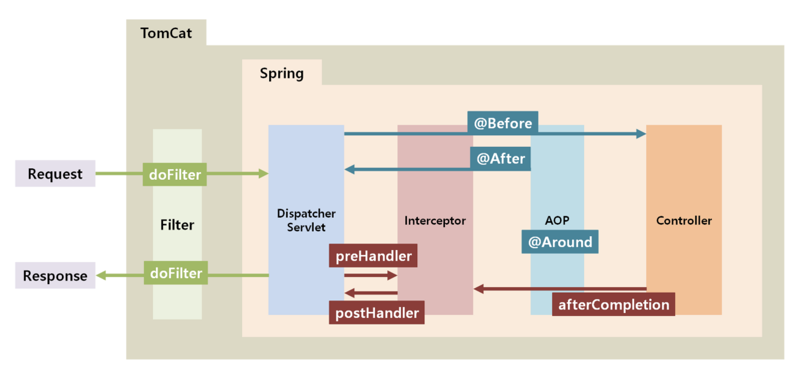

<br/>
<br/>
<br/>


## ❓ERROR 
스프링 AOP를 구현하는 과정에서 AOP 단에 도달하기 전부터 json 파싱 에러가 발생했다. 

    Resolved [org.springframework.http.converter.HttpMessageNotReadableException: JSON parse error: Cannot deserialize value of type `noums.study.pizzahouse.enums.FoodMenu` from String "ggg"

처음엔 왜 AOP 에 도달도 하기 전에 json 파싱 에러가 나는것인지 이유를 몰라 한참을 삽질하였다. 

결론은 RequestBody 에서 Json 객체를 받아와 Enum 클래스에 매핑하는 과정에서 매핑 오류가 발생한 것이였다. 

<br/>
<br/>
<br/>

## AOP 전에 JSON parse error 가 나는 이유 

<br/>




스프링 컨테이너 안에서 실행순서를 보면 

`dispatcher servlet → interceptor → AOP → Controller` 이다. 


request body 를 읽어와서 json을 파싱하는 과정의 순서는 

 `interceptor - requestbody json parsing → AOP` 이다. 

request로 받아온 json 객체가 먼저 파싱되고 난 뒤에 AOP단으로 넘어가기 때문에, ENUM객체와 맞지않는 값이 json 객체로 넘어갈 경우 json parse error 가 나는 것이다.

<br/>
<br/>
<br/>


## 💡해결방안  

Enum 클래스 안에서 @JsonCreater 어노테이션으로 처리를 해줌으로써 json 파싱을 컨트롤 할 수 있게 된다.

```java
@JsonCreator
    public static FoodMenu fromJson(String menu){
        System.out.println(">>>>>> JsonCreater :: "+ menu);
        for (FoodMenu foodMenu : FoodMenu.values()) {
            if ( foodMenu.toString().equals(menu) ) {
                System.out.println(">>>>>> correct !");
                return foodMenu;
            }
        }
        return null;
    }
```

넘어온 객체가 ENUM 필드값과 맞지 않을 경우 null 을 return 해준다. 