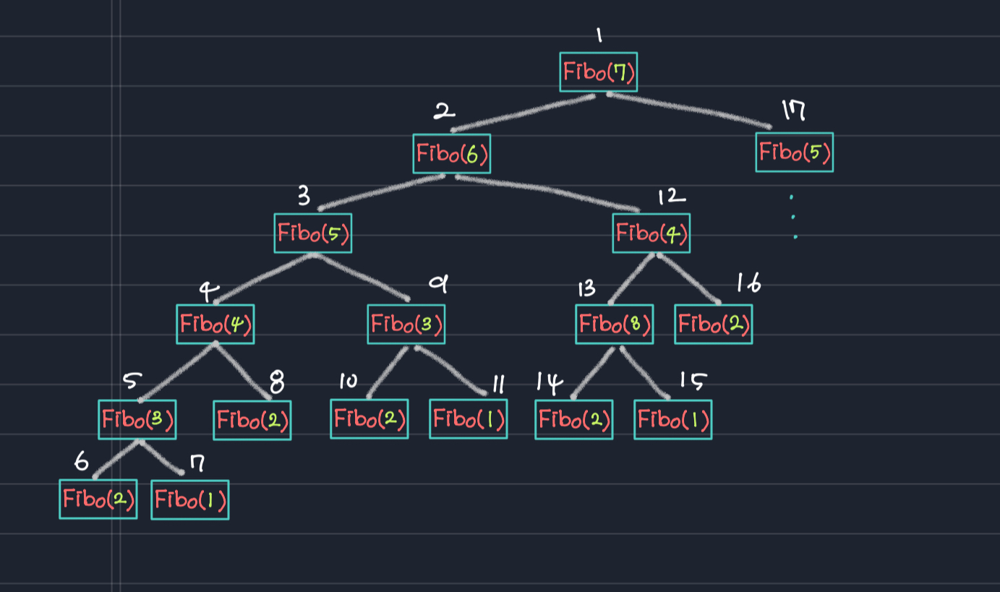

<br/>
<br/>
<br/>

# 🍑 피보나치 수열(Fibbonacci Sequence)

<br/>

피보나치 수열은 앞의 두 숫자를 더한 값으로 나열된 재귀적인 형태를 띠는 대표적인 수열이다. 

<br/>
<br/>


```
n = (n-1) + (n-2)
```
출력형태 :  ``` 0, 1, 1, 2, 3, 5, 8, 13, 21, 34, 55 ... ```

<br/>

피보나치 수열의 n 번째값을 반환하는 함수 
```c
int Fibo(int n){ // 피보나치 수열의 n 번째 값 반환
    if(n=1) return 0;   // 피보나치 수열의 첫 번째 값을 요구했을 떄       
    else if(n=2) return 1;  // 두 번째 값을 요구했을 때
    else return Fibo(n-1) + Fibo(n-2);  // 세번째 이후의 값을 요구했을 때
}
```
<br/>

함수 활용 예제 
```c
int Fibo(int n){ // 피보나치 수열의 n 번째 값 반환
    if(n=1) return 0;   // 피보나치 수열의 첫 번째 값을 요구했을 떄       
    else if(n=2) return 1;  // 두 번째 값을 요구했을 때
    else return Fibo(n-1) + Fibo(n-2);  // 세번째 이후의 값을 요구했을 때
}

int main(void)
{
    int i;
    for(i=1; i<15; i++>)
        printf("%d",Fibo(i));

    return 0;
}
```
<br/>

 출력 결과 
 > 0, 1, 1, 2, 3, 5, 8, 13, 21, 34, 55, 89, 144, 233 

다음과 같이 피보나치 수열을 구하는데 재귀함수가 적절했음을 알 수 있지만, 성능의 불리함은 존재할 수 있다. 

<br/>
예를들어 7번째 값을 출력하기 위해 25번의 함수호출이 발생한다. 

``` return Fibo(n-1) + Fibo(n-2) // return Fibo(6) + Fibo(5)```

위의 코드로 재귀함수가 호출될 때, + 연산자의 왼편에 있는 Fibo 함수호출이 완료되어야 오른편의 Fibo함수호출이 진행된다. 

<br/>
<br/>



위와 같이 피보나치함수 호출 순서는 오른쪽 -> 왼쪽 순으로 흘러간다.