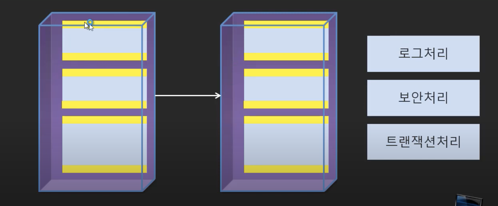
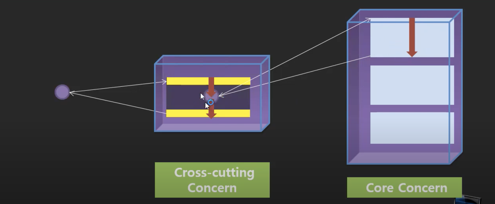
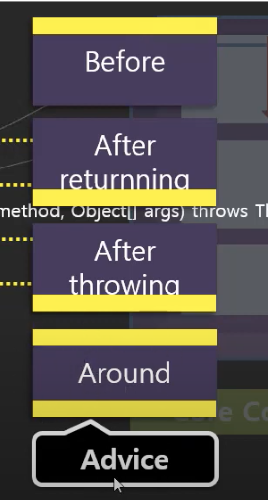

<br/>
<br/>
<br/>

# AOP(Aspected-Oriented Programming)

- 스프링과 별개로 방법론임
- OOP는 사용자 관점에서의 주 업무 로직을 위주로 구현하는 것. 반면 AOP 는 주 업무 로직을 구현함에 있어서 개발자나 운영자 및 관리자가 필요에 따라서 코드를 끼워넣게 되는 부가적인 기능(ex. 로그처리, 트렌젝션 등...)을 모듈화하는 것.
- 즉, 사용자 관점, 개발자 관점, 운영자 관점, 등등..여러 관점들을 고려해서 로직을 분리하고 모듈화하는 방법론이기 때문에 Aspected 관점 지향적 프로그램이이라고 한다.
  
<br/>

### Concern - Primary(Core) Concern & Cross-cutting concern



- primary(Core) Concern : 핵심 로직
- Cross-cutting Concern : 핵심로직을 위 아래로 감싸고 있는 부가적인 공통 로직

<br/>

### AOP 구현 방식

- 프록시로 위임과 부가작업을 통해 AOP를 구현한다.



<br/>
<br/>

 

### Proxy

1) 프록시란? 기존 코드에 영향을 주지 않고 타깃의 기능을 확장하고 접근방법을 제어하는 방법

2) 프록시의 역할

- 타겟으로 요청을 위임
- 부가기능을 수행
- 프록시팩토리에게 인터페이스 정보를 제공해주면 해당 인터페이스를 구현한 클래스의 오브젝트를 자동으로 만들어준다
- 인터페이스를 기반으로 Proxy를 생성해주는 방식

- ***순수 자바로*** ***proxy 만들기***

    ```java
    // 타깃클래스의 인터페이스
    package noums.aop.entity;

    public interface Exam {
    	
    	public int total();
    	public float avg();

    }
    ```

    ```java
    // 타깃 클래스
    package noums.aop.entity;

    public class ExamImpl implements Exam {
    	
    	private int kor;
    	private int eng;
    	private int math;
    	
        public ExamImpl() {
    		// TODO Auto-generated constructor stub
    	}
        
        public ExamImpl(int kor, int eng, int math) {
    		this.kor = kor;
    		this.eng = eng;
    		this.math = math;
    	}
    	
    	public int getKor() {
    		return kor;
    	}

    	public void setKor(int kor) {
    		this.kor = kor;
    	}

    	public int getEng() {
    		return eng;
    	}

    	public void setEng(int eng) {
    		this.eng = eng;
    	}

    	public int getMath() {
    		return math;
    	}

    	public void setMath(int math) {
    		this.math = math;
    	}

    	@Override
    	public int total() {
    		// 부가로직 
    //		long start = System.currentTimeMillis();
    		// 핵심로직 
    		int result = kor+eng+math;
    		
    //		try {
    //			Thread.sleep(200);
    //		} catch (InterruptedException e) {
    //			// TODO Auto-generated catch block
    //			e.printStackTrace();
    //		}
    //		
    //		// 부가로직 
    //		long end = System.currentTimeMillis();
    //				
    //		String message = (end-start) + "ms 시간 소요 ";
    //		System.out.println(message);
    		return result;
    	}
    	@Override
    	public float avg() {
    		
    		// 핵심업무 
    		float result = total() / 3.0f;
    		
    		return result;
    	}
    	
    	

    }
    ```

    ```java
    package noums.aop;

    import java.lang.reflect.InvocationHandler;
    import java.lang.reflect.Method;
    import java.lang.reflect.Proxy;

    import noums.aop.entity.Exam;
    import noums.aop.entity.ExamImpl;

    public class Project {

    	public static void main(String[] args) {
    		
    		Exam exam = new ExamImpl(1,1,1); // 타깃은 인터페이스를 통해 접근하는 습관을 들이자
    		
    		//자바에서 제공 proxy  
    		// loader : 실제 로드할 객체 , 
    		// interfaces : 핵심로직이 구현한 인터페이스. 핵심로직이 여러개의 인터페이스를 구현하고있을 수 있기 때문에 배열로 선언해준다.
    		// h : 부가기능을 꽂을 수 있는 부분 
    		Exam proxyExam = (Exam) Proxy.newProxyInstance(Exam.class.getClassLoader(), 
    				new Class[] {Exam.class}, 
    				new InvocationHandler() {
    					
    					@Override
    					public Object invoke(Object proxy, Method method, Object[] args) throws Throwable {
    						// 부가기능 
    						long start = System.currentTimeMillis();
    						
    						// 핵심기능 호출 
    						Object result = method.invoke(exam, args); // args : exam 에서 구현하고있는 메서드들을 파라미터로 가져옴 
    						
    						// 부가기능 
    						long end = System.currentTimeMillis();
    								
    						String message = (end-start) + "ms 시간 소요 ";
    						System.out.println(message);
    						return result;
    					}
    				}
    				);
    		
    		System.out.println("total is "+ proxyExam.avg());
    	}

    }
    ```

    <br/>
    <br/>
    <br/>

    *출력*

    

    1. Exam인터페이스 제공 
    2. 프록시팩토리에게 나이내픽 프록시 만들어달라고 요청 
    3. Exam인터페이스의 모든 메소드를 구현한 오브젝트 생성 
    4. InvokationHandler 인터페이스를 구현한 오브젝트를 제공 → 다이내믹 프록시가 받은 모든 요청을 InvokationHandler 의 invoke() 메소드로 보내줌. 
    5. Exam인터페이스의 메소드가 아무리 많아도 invoke 메소드 하나로 처리할 수 있다. 

<br/>
<br/>

## Sprnig AOP

스프링은 프록시 기반의 AOP 기능을 제공한다. 런타임 시점에 타겟 클래스에 대한 부가기능을 실행해줄 프록시 빈을 생성해준다. (자동 프록시 생성기)

용어 

- Aspect : 공통코드를 모듈화 한 것
- Target : Aspect 가 적용되는 곳
- Advice : 순수하게 부가기능만 실제로 구현된 부분. 부가기능 구현체
    - Advice 종류

        - Before
        - After returnning
        - After throwing : 예외가 발생된 후 동작
        - Around : 메소드의 실행 자체를 제어할 수 있다.

- Joint point :  Advice 가 Target에 적용되는 시점
- Point cut :  Joint point 의 상세스펙을 정의한 것
    - pointcut 종류

        [pointcut 종류 ](https://www.notion.so/2c54cf5f785c47ac922ca4e64f3bb6f5)