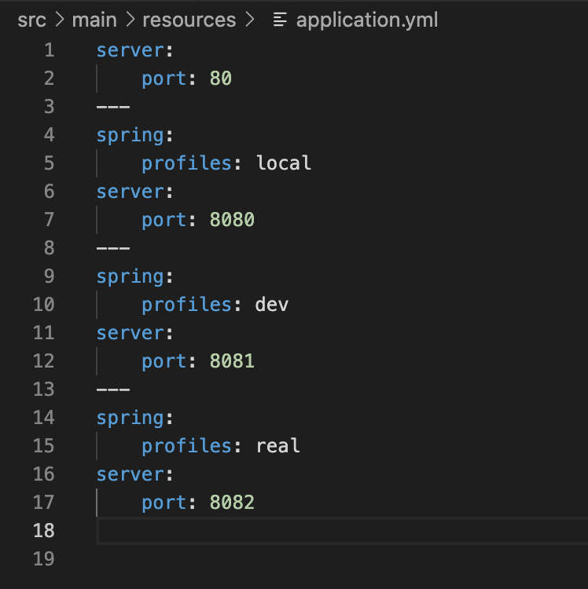

<br/>
<br/>
<br/>


# 🚀 프로파일에 따른 환경구성 분리하기 

실제 서비스에서 개발을 하게되면 로컬DB, 개발DB, 운영DB의 설정값이 다 다르다. 이런 경우를 대비해 프로파일에 따라 프로퍼티를 다르게 설정해야 함. 

> 참고 : apllication.properties 대신 application.yml을 사용하였다.

<br/>
<br/>

## 1. YAML 파일에서 프로퍼티 설정 구분하는 방법 


--- 을 기준으로 설정값을 나눈다. 


<br/>
<br/>

## 2. application-{prifile}.yml 을 이용한 방법 

{prifile}에 원하는 프로파일 값으로 YAML 파일을 추가하면 어플리케이션 실행 시 지정한 프로파일값으로 실행된다. 

ex) dev라는 프로파일값으로 어플리케이션을 실행하면 application-dev.yml 파일을 읽어서 환경이 구성된다. 

디폴트 프로퍼티를 정의하려면 application.yml 파일에 정의하면 된다. 

<br/>
<br/>

### ✔ 프로파일값을 적용하여 어플리케이션을 실행하는 방법 

스프링부트는 JAR 파일로 빌드하여 서버에서 간단한 명령어로 실행된다. 

```$ java -jar ... -D spring.profiles.active=dev ```

<br/>
<br/>
<br/>

---
references

- 처음 배우는 스프링부트 - 한빛미디어