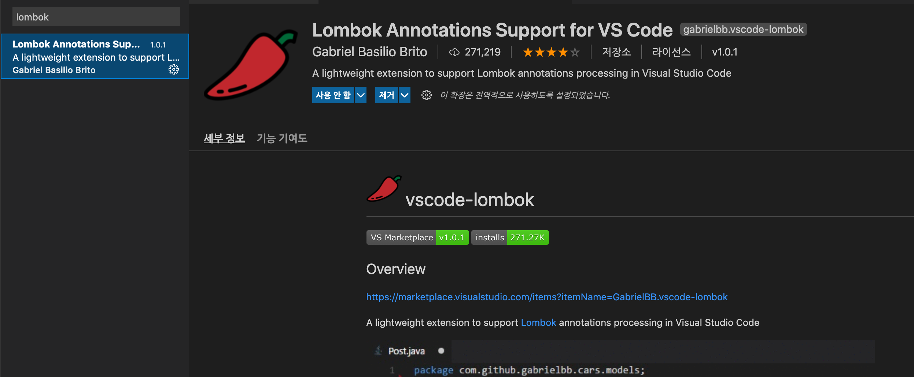

<br/>
<br/>
<br/>


# 🚀 vscode 마켓플레이스에서 lombok 설치





<br/>
<br/>
<br/>


# 🚀 gradle.build 파일에 lombok의존성 추가 

<br/>

```xml

dependencies {
	implementation 'org.springframework.boot:spring-boot-starter-web'
	developmentOnly 'org.springframework.boot:spring-boot-devtools'
	testImplementation 'org.springframework.boot:spring-boot-starter-test'

     compileOnly 'org.projectlombok:lombok'
     testCompileOnly 'org.projectlombok:lombok'
     annotationProcessor 'org.projectlombok:lombok'
     testAnnotationProcessor 'org.projectlombok:lombok'
}
```


<br/>
<br/>
<br/>
<br/>

> lombok 의존성 추가 후 적용 안되는 문제 

<br/>

처음엔 롬복 적용이 안되고 ``` cannot be resolved to a type  ``` 에러만 떠서 엄청 애먹었다. 

결국엔 ```.vscode``` 파일 삭제 후 다시 의존성을 추가하니까 정상적으로 적용되었음.

<br/>

***에러 해결 참고 사이트 : https://github.com/GabrielBB/vscode-lombok/issues/23***