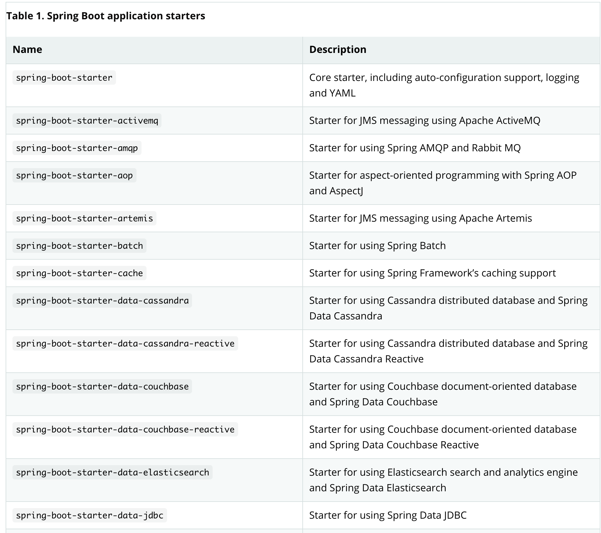

<br/>
<br/>


# 🚀 스프링부트 (Spring Boot)
환경설정을 최소화하여 생산성을 향상시켜준다. 

스프링 프레임워크 안에 속하는 도구일 뿐. 단지 설정을 간소화하기위해 노력한 도구이다. 서비스를 빠르게 개발하는데 도움이 된다. 

<br/>

## ✔ 특징 
* 통함 스타터를 제공하여 메이븐/그레이들 구성 간소화 
* 스타터를 통한 자동화된 스프링 설정 제공
* XML설정을 요구하지 않음 
* JAR를 통한 자바 옵션만으로 배포가 가능
* 스프링 액츄에이터(Spring Actuator)제공

<br/>
<br/>

## ✔ 스프링부트 스타터
의존 관계를 일일이 설정해줘야 하는 불편함이 있는 스프링과는 달리, 스타터를 이용해서 간편하게 설정할 수 있다. 스프링부트 스타터가 빌드에 필요한 의존성을 자동으로 관리해주기 때문에 필요한 라이브러리들을 일일이 찾아볼 필요가 없다. 

<br/>
<br/>
<br/>

## ✔ 스프링부트 명명규칙 
``` spring-boot-starter-* ```

' * ' 에 스타터명을 명시.
명명규칙을 알면 스타터를 쉽게 찾을 수 있다. 

<br/>
<br/>
<br/>

## ✔ 스타터 내부 의존성 확인 
###  특정 스타터를 사용하기에 앞서 의존 관계가 궁금할 때 [Spring Boot Regerence Guide](https://docs.spring.io/spring-boot/docs/current/reference/htmlsingle/#using-boot-starter) 를 참고하여 확인할 수 있다. 

<br/>
<br/>
스프링부트 스타터 목록 



<br/>
<br/>

> ### spring-boot-starter에서 제공하는 여섯가지 의존성
> 
<br/>

1. spring-boot : 스프링부트에서 기분 제공하는 의존성 
2. spring-boot-autoconfigure : 자동 환경 구성에 필요한 의존성 
3. spring-boot-starter-logging : 각종 로그를 사용하는데 필요한 의존성 
4. javax.annotations-api : 소프트웨어 결함을 탐지하는 어노테이션 지원
5. spring-core : 스프링 코어 사용 
6. snakeyaml : yaml을 사용하는데 필요한 의존성 

<br/>
<br/>
<br/>

## ✔ 스프링부트 장단점 

<br/>

***장점 )***
* 각각의 의존성 버전을 올리는 것이 수월하다. 스프링부트 버전이 올라갈 때마다 각 버전에대한 호환성 테스트를 거친 후 릴리즈 되기 때문에 안정된 버전이 제공된다. 
* 어노테이션과 프로퍼티 설정이 간단하기 때문에 복잡한 설정 없이 원하는 기능을 빠르게 적용 가능. 
* 별도의 외장 톰캣을 설치할 필요가 없으며, 톰캣 버전도 수월하게 관리가 가능하다. 

***단점)*** 
* 설정을 커스터마이징 하면 버전을 올릴 때 기존 스프링 프레임워크를 사용하는 것과 동일하게 이루어져야한다 (불편)
* 특정 설정을 커스터마이징하거나 변경하고싶을 땐 내부의 설정코드를 살펴봐야 하는 불편함이 있다. 
  
<br/>
<br/>
<br/>
<br/>


---
***references***

- 처음 배우는 스프링부트 - 한빛미디어
- https://docs.spring.io/spring-boot/docs/current/reference/htmlsingle/